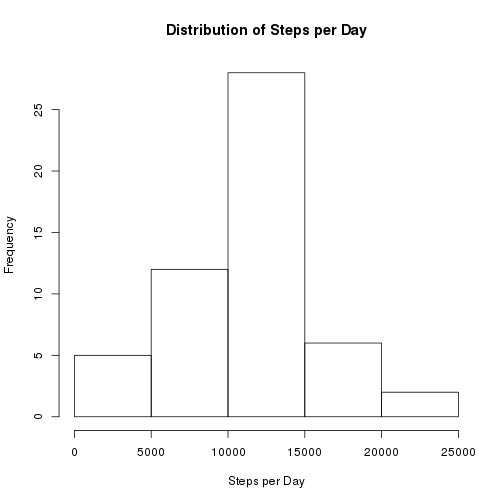
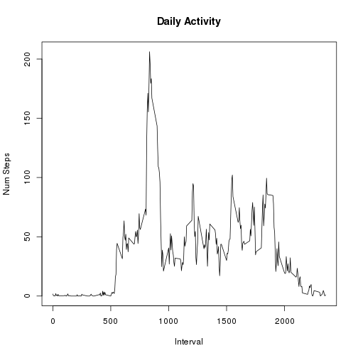
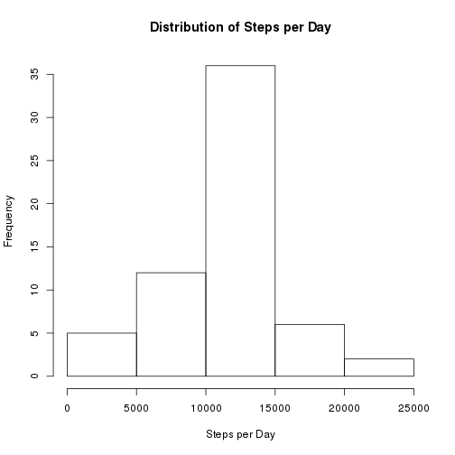
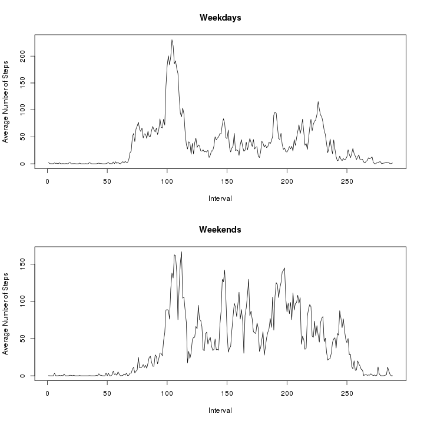

Steps per Day Analysis
=============

This report looks at data from an activity monitor, which measures the number of steps taken at 5 minute intervals during the day. The data consists of two months of data from an anonymous individual collected during the months of October and November, 2012.

The variables in the dataset are:
* steps: The number of steps taken in a 5-minute interval. Some values are missing.
* date: The date in YYYY-MM-DD format for the measurements
* interval: Identifier for the 5-minute interval in which the measurement was taken. These identifiers range from 0 to 2355, in steps of 5, each day.

### Total Steps per Day
First, we read in the raw data and look at how the steps are distributed per day. To do this we sum the number of steps taken in each day, then look at the histogram and mean and median of those totals.


```r
# original data
odata <- read.csv('activity.csv')

# sum the number of steps per day
steps <- by(odata$steps, odata$date, sum)
s <- do.call(rbind, as.list(steps))

hist(s, main="Distribution of Steps per Day", xlab="Steps per Day")
```

 

The mean number of steps per day, not including values which were 'NA', is 10766.19. The median number of steps per day is 10765.

### Average Daily Activity Pattern

Next, we want to look at average daily activity. This graph shows the average number of steps taken in each 5-minute interval, averaged across all the days:


```r
# Remove entries where steps == NA
ndata <- odata[!is.na(odata$steps),]    
# computer average steps per interval
a <- tapply(ndata$steps, ndata$interval, FUN=mean)      
plot(names(a), a, type='l', main="Daily Activity", xlab="Interval", ylab="Num Steps")
```

 

The time interval which contains the highest number of steps is 1705 - that step count is 206.2.

We noted that there are some missing values in the data, coded as NA. The number of missing values is 2304. (The total number of values is 17568)

We are going to fill in the missing values with the average of the real values for that interval. Then again show a histogram, the median and the mean values.


```r
# this adds a column that is the average of the given intervals - we
# already calculated this, so just tack it on
odata$average <- a

# then create a data frame that has all the information we need
f <- data.frame(odata$steps, odata$date, odata$interval, odata$average,
        stringsAsFactors=FALSE)
names(f) <- c("steps", "date", "interval", "average")
# if the value is missing, use the average
f$steps <- ifelse(is.na(f$steps), f$average, f$steps)

# and calculate the same distribution of steps per day with the new data
steps <- by(f$steps, f$date, sum)
s <- do.call(rbind, as.list(steps))
hist(s, main="Distribution of Steps per Day", xlab="Steps per Day")
```

 

```r
median(s)
```

```
## [1] 10766.19
```

```r
mean(s)
```

```
## [1] 10766.19
```

Note that since we filled in the missing values with the average, the new average didn't really change. If we had filled in the missing values with something else, such as 0, we would get something more different from the original values. 

## Weekdays vs Weekends
Next we explore whether there are different patterns on the weekend, when compared to weekdays.

To do this, we create a two-valued variable, called 'day', which is either 'weekend' or 'weekday'. Then we plot the average number of steps per interval for each type of day.


```r
weekend <- c("Sat", "Sun")
f$day <- as.factor(ifelse(weekdays(as.Date(f$date), abbreviate=TRUE) %in% weekend, "weekend", "weekday"))

# now create two arrays, one for each type of day
wday <- f[which(f$day == "weekday"),]
wend <- f[which(f$day == "weekend"),]

# compute the average steps per interval for each type of day
wday_steps <- tapply(wday$steps, wday$interval, FUN=mean)
wend_steps <- tapply(wend$steps, wend$interval, FUN=mean)

# plot the results
par(mfrow=c(2,1))
plot(wday_steps, type='l', main="Weekdays", xlab="Interval", ylab="Average Number of Steps")
plot(wend_steps, type='l', main="Weekends", xlab="Interval", ylab="Average Number of Steps")
```

 
